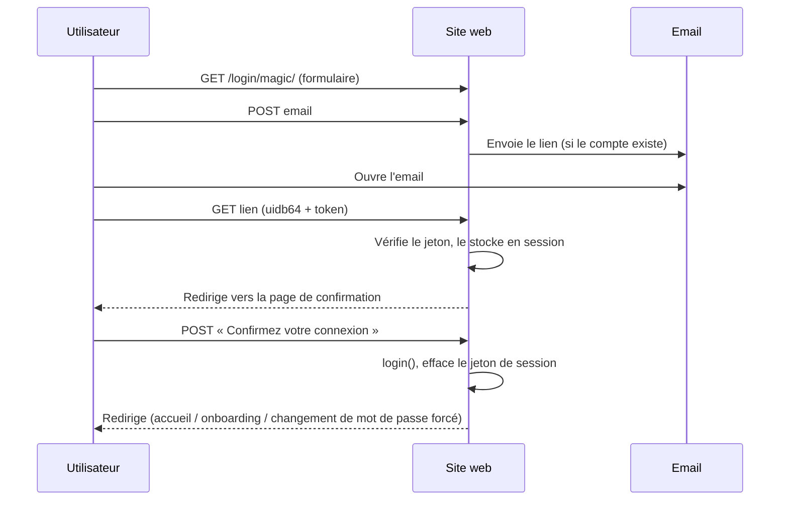

# Authentification

Le site propose deux méthodes de connexion : email + mot de passe (classique), et
connexion par lien magique (« magic link », sans mot de passe). Cette page détaille
le fonctionnement de la seconde ; voir [`permissions.md`](permissions.md) pour la
surface publique (non authentifiée) exposée par chacune.

## Connexion par lien magique

### Déroulement

1. Sur la page de connexion, l'utilisateur clique sur « Recevez un lien de connexion
   par email » (`MagicLinkRequestView`, vue publique).
2. Il saisit son adresse email et valide le formulaire. Cette vue réutilise
   `PasswordResetForm` de Django **sans le modifier** : `get_users()` ne renvoie que
   les `Account` existants, actifs, avec un mot de passe utilisable — aucun compte
   n'est jamais créé depuis ce formulaire (garantie d'inscription fermée).
3. Si un compte correspond, un email est envoyé avec un lien contenant un jeton à
   usage unique, valable `MAGIC_LINK_TIMEOUT` secondes (15 minutes par défaut,
   réglable via la variable d'environnement du même nom). Qu'un compte existe ou non,
   la page affichée après validation est identique (`magic-link-sent`), pour ne pas
   révéler quelles adresses sont enregistrées.
4. Cliquer sur le lien reçu (`magic-link-confirm-token`) ne connecte **pas**
   immédiatement l'utilisateur : le jeton est vérifié, puis stocké en session, et la
   page redirige vers une étape de confirmation (`magic-link-confirm`) affichant un
   simple bouton « Confirmez votre connexion ».
5. C'est uniquement le `POST` de ce bouton qui appelle `django.contrib.auth.login()`
   et connecte l'utilisateur, puis applique les mêmes règles de redirection que la
   confirmation de réinitialisation de mot de passe : changement de mot de passe forcé
   en premier, puis onboarding si première connexion, sinon page d'accueil.

### Pourquoi une étape de confirmation en deux temps ?

Certains clients de messagerie et scanners anti-phishing ouvrent automatiquement les
liens reçus pour les analyser, avant même que l'utilisateur ne clique dessus. Le jeton
étant à usage unique, un scan automatique le consommerait silencieusement et
l'utilisateur se retrouverait avec un lien déjà « utilisé » sans avoir rien fait. En
séparant la validation du lien (un simple `GET`, idempotent) de la connexion
elle-même (un `POST` déclenché uniquement par un vrai clic sur le bouton), ce risque
disparaît. Ce même schéma en deux temps est celui que Django utilise déjà pour la
confirmation de réinitialisation de mot de passe.

### Isolation du jeton de connexion

Le jeton de lien magique est généré par `MagicLinkTokenGenerator`
(`annuaire/tokens.py`), qui hérite de `PasswordResetTokenGenerator` mais utilise un
**`key_salt` distinct** de celui des jetons de réinitialisation de mot de passe. Sans
cette isolation, un lien de réinitialisation — affiché à l'écran aux membres du staff
lors de la création groupée de comptes (`bulk_account_create.html`) — aurait pu être
rejoué sur l'URL de connexion par lien pour se connecter silencieusement à la place
d'un autre membre. Un jeton de réinitialisation est donc explicitement rejeté par le
flux de connexion par lien, et inversement (couvert par des tests dédiés dans
`annuaire/tests/test_views_magic_link.py`).

En plus de la vérification de signature et du plafond `PASSWORD_RESET_TIMEOUT` déjà
appliqués par la classe parente, `MagicLinkTokenGenerator.check_token()` impose en
plus la durée de vie plus courte `MAGIC_LINK_TIMEOUT`.

### Autres garanties

- `login()` contourne les vérifications habituelles des backends d'authentification
  (`is_active`, mot de passe utilisable) : `MagicLinkConfirmView.post()` vérifie donc
  explicitement `user.is_active` avant de connecter l'utilisateur.
- Le lien ne supporte pas de paramètre `?next=` : un lien reçu par email n'a pas de
  destination de redirection légitime à faire porter par l'URL, et l'omettre supprime
  toute surface de redirection ouverte.
- `MagicLinkConfirmView` est une vue simple (pas une sous-classe des vues
  d'authentification de Django), donc explicitement décorée `login_not_required` —
  sans quoi `LoginRequiredMiddleware` (actif globalement sur ce projet) la
  bloquerait par défaut.
- `/annuaire/login/magic/` est listé dans
  `ForcePasswordChangeMiddleware.EXEMPT_URL_PREFIXES` (`annuaire/middleware.py`), pour
  qu'un compte avec `must_change_password=True` puisse tout de même terminer le flux
  au lieu d'être redirigé avant même d'atteindre la vue.

### Pour aller plus loin

- Page d'aide destinée aux membres (en français, dans l'application) :
  `/annuaire/aide/connexion-par-lien/` (`MagicLinkHelpView`, gabarit
  `annuaire/templates/annuaire/help_magic_link.html`).
- Limitation de débit (rate limiting) sur les endpoints publics d'envoi d'email
  (réinitialisation de mot de passe et lien magique) : pas encore implémentée, faute
  de backend de cache partagé — voir l'item `B.3` du backlog dans `ROADMAP.md`.
