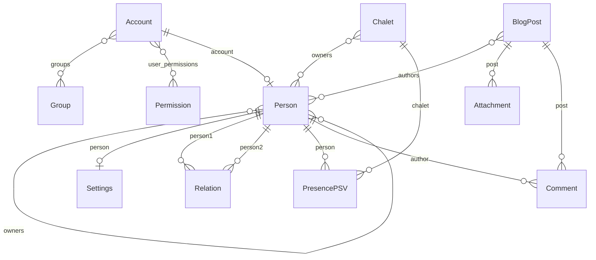

# Data model

> **Auto-generated — do not edit by hand.**
> Regenerate with `uv run python manage.py generate_data_model_docs` after any change to `models.py` in `annuaire` or `publications`.

## Entity-relationship diagram

## `annuaire`

### `Account`

*App:* `annuaire` · *verbose name:* account / accounts · *table:* `annuaire_account`

| Field | Type | Verbose name | Notes |
|---|---|---|---|
| `id` | BigAutoField | ID | PK |
| `password` | CharField | mot de passe | max_length=128, required |
| `last_login` | DateTimeField | dernière connexion | optional |
| `is_superuser` | BooleanField | statut super-utilisateur | default=False, required |
| `email` | CharField | Adresse email | max_length=254, unique, required |
| `is_active` | BooleanField | Actif | default=True, required |
| `is_staff` | BooleanField | Membre du personnel | default=False, required |
| `must_change_password` | BooleanField | Doit changer le mot de passe | default=False, required |
| `groups` | ManyToManyField | groups | → Group (M2M), related_name='account_set' |
| `user_permissions` | ManyToManyField | user permissions | → Permission (M2M), related_name='account_set' |

### `Person`

*App:* `annuaire` · *verbose name:* person / persons · *table:* `annuaire_person`

| Field | Type | Verbose name | Notes |
|---|---|---|---|
| `id` | BigAutoField | ID | PK |
| `last_name` | CharField | Nom | max_length=100, required |
| `account` | OneToOneField | Compte | → Account (on_delete=SET_NULL), related_name='profile', unique, optional |
| `first_name` | CharField | Prénom | max_length=100, required |
| `email` | CharField | Adresse électronique | max_length=254, optional |
| `profile_photo` | FileField | Photo de profil | max_length=100, optional |
| `postal_address` | CharField | Adresse postale | max_length=255, optional |
| `latitude` | DecimalField | Latitude | optional |
| `longitude` | DecimalField | Longitude | optional |
| `phone_number` | CharField | Numéro de téléphone | max_length=25, optional |
| `birth_date` | DateField | Date de naissance | optional |
| `description` | TextField | Infos utiles | optional |
| `owners` | ManyToManyField | Propriétaires | → Person (M2M), related_name='managed_profiles' |

### `Settings`

*App:* `annuaire` · *verbose name:* Paramètres de notification / Paramètres de notification · *table:* `annuaire_settings`

| Field | Type | Verbose name | Notes |
|---|---|---|---|
| `id` | BigAutoField | ID | PK |
| `person` | OneToOneField | Profil | → Person (on_delete=CASCADE), related_name='settings', unique, required |
| `notify_on_birthday` | BooleanField | Recevoir un rappel pour les anniversaires | default=False, optional |
| `notify_on_new_blog_post` | BooleanField | Recevoir une notification pour les nouveaux articles | default=False, optional |

### `Relation`

*App:* `annuaire` · *verbose name:* relation / relations · *table:* `annuaire_relation`

| Field | Type | Verbose name | Notes |
|---|---|---|---|
| `id` | BigAutoField | ID | PK |
| `person1` | ForeignKey | Personne | → Person (on_delete=CASCADE), related_name='ascending_relations', required |
| `person2` | ForeignKey | En relation avec | → Person (on_delete=CASCADE), related_name='descending_relations', required |
| `relationship_type` | IntegerField | Type de relation | choices: 0=mariage, 1=conjoint, 2=parent, 3=enfant, required |
| `start_date` | DateField | Date de début | optional |

### `Chalet`

*App:* `annuaire` · *verbose name:* chalet / chalets · *table:* `annuaire_chalet`

| Field | Type | Verbose name | Notes |
|---|---|---|---|
| `id` | BigAutoField | ID | PK |
| `name` | CharField | Nom | max_length=100, required |
| `address` | CharField | Adresse | max_length=255, required |
| `gps_coordinates` | CharField | Coordonnées GPS | max_length=100, optional |
| `latitude` | DecimalField | Latitude | optional |
| `longitude` | DecimalField | Longitude | optional |
| `photo` | FileField | Photo | max_length=100, optional |
| `owners` | ManyToManyField | Propriétaires | → Person (M2M), related_name='owned_chalets' |

### `PresencePSV`

*App:* `annuaire` · *verbose name:* presence psv / presence psvs · *table:* `annuaire_presencepsv`

| Field | Type | Verbose name | Notes |
|---|---|---|---|
| `id` | BigAutoField | ID | PK |
| `person` | ForeignKey | Personne | → Person (on_delete=CASCADE), required |
| `chalet` | ForeignKey | Chalet | → Chalet (on_delete=CASCADE), required |
| `start_date` | DateField | Date d'arrivée | required |
| `end_date` | DateField | Date de départ | required |

## `publications`

### `BlogPost`

*App:* `publications` · *verbose name:* Publication / Publications · *table:* `publications_blogpost`

| Field | Type | Verbose name | Notes |
|---|---|---|---|
| `id` | BigAutoField | ID | PK |
| `title` | CharField | Titre | max_length=200, required |
| `body` | TextField | Contenu | required |
| `post_type` | CharField | Type de publication | max_length=10, choices: BC=Busson connection, NORMAL=Publication normale, default='NORMAL', required |
| `created_at` | DateTimeField | Date de création | auto_now_add, optional |
| `updated_at` | DateTimeField | Dernière modification | auto_now, optional |
| `authors` | ManyToManyField | Auteur(s) | → Person (M2M), related_name='blog_posts' |

### `Attachment`

*App:* `publications` · *verbose name:* Pièce jointe / Pièces jointes · *table:* `publications_attachment`

| Field | Type | Verbose name | Notes |
|---|---|---|---|
| `id` | BigAutoField | ID | PK |
| `post` | ForeignKey | Publication | → BlogPost (on_delete=CASCADE), related_name='attachments', required |
| `file` | FileField | Fichier | max_length=100, required |
| `caption` | CharField | Légende | max_length=255, default='', optional |
| `is_image` | BooleanField | Est une image | default=False, required |
| `uploaded_at` | DateTimeField | Date de téléversement | auto_now_add, optional |

### `Comment`

*App:* `publications` · *verbose name:* Commentaire / Commentaires · *table:* `publications_comment`

| Field | Type | Verbose name | Notes |
|---|---|---|---|
| `id` | BigAutoField | ID | PK |
| `post` | ForeignKey | Publication | → BlogPost (on_delete=CASCADE), related_name='comments', required |
| `author` | ForeignKey | Auteur | → Person (on_delete=SET_NULL), related_name='comments', optional |
| `body` | TextField | Commentaire | required |
| `created_at` | DateTimeField | Date de création | auto_now_add, optional |
