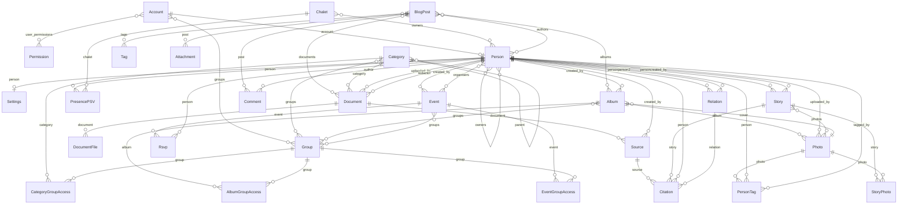

# Data model

> **Auto-generated — do not edit by hand.**
> Regenerate with `uv run python manage.py generate_data_model_docs` after any change to `models.py` in `annuaire` or `publications`.

## Entity-relationship diagram

## `annuaire`

### `Account`

*App:* `annuaire` · *verbose name:* account / accounts · *table:* `annuaire_account`

| Field | Type | Verbose name | Notes |
|---|---|---|---|
| `id` | BigAutoField | ID | PK |
| `password` | CharField | mot de passe | max_length=128, required |
| `last_login` | DateTimeField | dernière connexion | optional |
| `is_superuser` | BooleanField | statut super-utilisateur | default=False, required |
| `email` | CharField | Adresse email | max_length=254, unique, required |
| `is_active` | BooleanField | Actif | default=True, required |
| `is_staff` | BooleanField | Membre du personnel | default=False, required |
| `must_change_password` | BooleanField | Doit changer le mot de passe | default=False, required |
| `last_feed_seen_at` | DateTimeField | Dernière consultation du fil | optional |
| `calendar_token` | CharField | Jeton calendrier | max_length=64, unique, optional |
| `groups` | ManyToManyField | groups | → Group (M2M), related_name='account_set' |
| `user_permissions` | ManyToManyField | user permissions | → Permission (M2M), related_name='account_set' |

### `Person`

*App:* `annuaire` · *verbose name:* person / persons · *table:* `annuaire_person`

| Field | Type | Verbose name | Notes |
|---|---|---|---|
| `id` | BigAutoField | ID | PK |
| `last_name` | CharField | Nom | max_length=100, required |
| `account` | OneToOneField | Compte | → Account (on_delete=SET_NULL), related_name='profile', unique, optional |
| `first_name` | CharField | Prénom | max_length=100, required |
| `email` | CharField | Adresse électronique | max_length=254, optional |
| `profile_photo` | FileField | Photo de profil | max_length=100, optional |
| `postal_address` | CharField | Adresse postale | max_length=255, optional |
| `latitude` | DecimalField | Latitude | optional |
| `longitude` | DecimalField | Longitude | optional |
| `phone_number` | CharField | Numéro de téléphone | max_length=25, optional |
| `birth_date` | DateField | Date de naissance | optional |
| `birth_place` | CharField | Lieu de naissance | max_length=255, default='', optional |
| `deceased` | BooleanField | Décédé·e | default=False, required |
| `death_date` | DateField | Date de décès | optional |
| `death_place` | CharField | Lieu de décès | max_length=255, default='', optional |
| `description` | TextField | Infos utiles | optional |
| `export_privacy` | CharField | Confidentialité dans les exports | max_length=6, choices: auto=Automatique (masqué·e tant que vivant·e), share=Toujours partager, redact=Toujours masquer, default=Person.ExportPrivacy.AUTO, optional |
| `search_vector` | SearchVectorField | Vecteur de recherche | required |
| `search_text` | TextField | Texte de recherche | default='', optional |
| `created_at` | DateTimeField | Date de création | auto_now_add, optional |
| `owners` | ManyToManyField | Propriétaires | → Person (M2M), related_name='managed_profiles' |

### `Settings`

*App:* `annuaire` · *verbose name:* Paramètres de notification / Paramètres de notification · *table:* `annuaire_settings`

| Field | Type | Verbose name | Notes |
|---|---|---|---|
| `id` | BigAutoField | ID | PK |
| `person` | OneToOneField | Profil | → Person (on_delete=CASCADE), related_name='settings', unique, required |
| `notify_on_birthday` | BooleanField | Recevoir un rappel pour les anniversaires | default=True, optional |
| `notify_on_new_blog_post` | BooleanField | Recevoir une notification pour les nouveaux articles | default=True, optional |
| `notify_on_event` | BooleanField | Recevoir les annonces et rappels d'événements | default=True, optional |

### `Relation`

*App:* `annuaire` · *verbose name:* relation / relations · *table:* `annuaire_relation`

| Field | Type | Verbose name | Notes |
|---|---|---|---|
| `id` | BigAutoField | ID | PK |
| `person1` | ForeignKey | Personne | → Person (on_delete=CASCADE), related_name='ascending_relations', required |
| `person2` | ForeignKey | En relation avec | → Person (on_delete=CASCADE), related_name='descending_relations', required |
| `relationship_type` | IntegerField | Type de relation | choices: 0=mariage, 1=conjoint, 2=parent, 3=enfant, required |
| `start_date` | DateField | Date de début | optional |
| `marriage_place` | CharField | Lieu du mariage | max_length=255, default='', optional |
| `end_date` | DateField | Date de fin | optional |

### `Chalet`

*App:* `annuaire` · *verbose name:* chalet / chalets · *table:* `annuaire_chalet`

| Field | Type | Verbose name | Notes |
|---|---|---|---|
| `id` | BigAutoField | ID | PK |
| `name` | CharField | Nom | max_length=100, required |
| `address` | CharField | Adresse | max_length=255, required |
| `latitude` | DecimalField | Latitude | optional |
| `longitude` | DecimalField | Longitude | optional |
| `photo` | FileField | Photo | max_length=100, optional |
| `owners` | ManyToManyField | Propriétaires | → Person (M2M), related_name='owned_chalets' |

### `PresencePSV`

*App:* `annuaire` · *verbose name:* presence psv / presence psvs · *table:* `annuaire_presencepsv`

| Field | Type | Verbose name | Notes |
|---|---|---|---|
| `id` | BigAutoField | ID | PK |
| `person` | ForeignKey | Personne | → Person (on_delete=CASCADE), required |
| `chalet` | ForeignKey | Chalet | → Chalet (on_delete=CASCADE), required |
| `start_date` | DateField | Date d'arrivée | required |
| `end_date` | DateField | Date de départ | required |

## `publications`

### `Tag`

*App:* `publications` · *verbose name:* Étiquette / Étiquettes · *table:* `publications_tag`

| Field | Type | Verbose name | Notes |
|---|---|---|---|
| `id` | BigAutoField | ID | PK |
| `name` | CharField | Étiquette | max_length=50, unique, required |
| `accent` | CharField | Accent | max_length=10, choices: =Aucun, gold=Doré, accent=Alpenglow, optional |

### `BlogPost`

*App:* `publications` · *verbose name:* Publication / Publications · *table:* `publications_blogpost`

| Field | Type | Verbose name | Notes |
|---|---|---|---|
| `id` | BigAutoField | ID | PK |
| `title` | CharField | Titre | max_length=200, required |
| `body` | TextField | Contenu | required |
| `post_type` | CharField | Type de publication | max_length=10, choices: BC=Busson connection, NORMAL=Publication normale, default='NORMAL', required |
| `created_at` | DateTimeField | Date de création | auto_now_add, optional |
| `updated_at` | DateTimeField | Dernière modification | auto_now, optional |
| `search_vector` | SearchVectorField | Vecteur de recherche | required |
| `search_text` | TextField | Texte de recherche | default='', optional |
| `tags` | ManyToManyField | Étiquettes | → Tag (M2M), related_name='posts' |
| `authors` | ManyToManyField | Auteur(s) | → Person (M2M), related_name='blog_posts' |
| `documents` | ManyToManyField | Documents liés | → Document (M2M), related_name='publications' |
| `albums` | ManyToManyField | Albums liés | → Album (M2M), related_name='publications' |

### `Attachment`

*App:* `publications` · *verbose name:* Pièce jointe / Pièces jointes · *table:* `publications_attachment`

| Field | Type | Verbose name | Notes |
|---|---|---|---|
| `id` | BigAutoField | ID | PK |
| `post` | ForeignKey | Publication | → BlogPost (on_delete=CASCADE), related_name='attachments', required |
| `file` | FileField | Fichier | max_length=100, required |
| `caption` | CharField | Légende | max_length=255, default='', optional |
| `is_image` | BooleanField | Est une image | default=False, required |
| `uploaded_at` | DateTimeField | Date de téléversement | auto_now_add, optional |

### `Comment`

*App:* `publications` · *verbose name:* Commentaire / Commentaires · *table:* `publications_comment`

| Field | Type | Verbose name | Notes |
|---|---|---|---|
| `id` | BigAutoField | ID | PK |
| `post` | ForeignKey | Publication | → BlogPost (on_delete=CASCADE), related_name='comments', required |
| `author` | ForeignKey | Auteur | → Person (on_delete=SET_NULL), related_name='comments', optional |
| `body` | TextField | Commentaire | required |
| `created_at` | DateTimeField | Date de création | auto_now_add, optional |

## `documents`

### `Category`

*App:* `documents` · *verbose name:* Catégorie / Catégories · *table:* `documents_category`

| Field | Type | Verbose name | Notes |
|---|---|---|---|
| `id` | BigAutoField | ID | PK |
| `name` | CharField | Nom | max_length=100, required |
| `parent` | ForeignKey | Catégorie parente | → Category (on_delete=PROTECT), related_name='children', optional |
| `description` | TextField | Description | default='', optional |
| `groups` | ManyToManyField | Groupes autorisés | → Group (M2M), related_name='document_categories' |

### `CategoryGroupAccess`

*App:* `documents` · *verbose name:* Accès groupe à catégorie / Accès groupes à catégories · *table:* `documents_categorygroupaccess`

| Field | Type | Verbose name | Notes |
|---|---|---|---|
| `id` | BigAutoField | ID | PK |
| `category` | ForeignKey | Catégorie | → Category (on_delete=CASCADE), required |
| `group` | ForeignKey | Groupe | → Group (on_delete=PROTECT), required |

### `Document`

*App:* `documents` · *verbose name:* Document / Documents · *table:* `documents_document`

| Field | Type | Verbose name | Notes |
|---|---|---|---|
| `id` | BigAutoField | ID | PK |
| `title` | CharField | Titre | max_length=200, required |
| `category` | ForeignKey | Catégorie | → Category (on_delete=PROTECT), related_name='documents', required |
| `document_date` | DateField | Date du document | optional |
| `description` | TextField | Description | default='', optional |
| `uploaded_by` | ForeignKey | Déposé par | → Person (on_delete=SET_NULL), related_name='documents', optional |
| `redactor` | ForeignKey | Rédigé par | → Person (on_delete=SET_NULL), related_name='redacted_documents', optional |
| `created_at` | DateTimeField | Date de création | auto_now_add, optional |
| `updated_at` | DateTimeField | Dernière modification | auto_now, optional |
| `search_vector` | SearchVectorField | Vecteur de recherche | required |
| `search_text` | TextField | Texte de recherche | default='', optional |

### `DocumentFile`

*App:* `documents` · *verbose name:* Fichier / Fichiers · *table:* `documents_documentfile`

| Field | Type | Verbose name | Notes |
|---|---|---|---|
| `id` | BigAutoField | ID | PK |
| `document` | ForeignKey | Document | → Document (on_delete=CASCADE), related_name='files', required |
| `file` | FileField | Fichier | max_length=100, required |
| `caption` | CharField | Légende | max_length=255, default='', optional |
| `uploaded_at` | DateTimeField | Date de téléversement | auto_now_add, optional |
| `extracted_text` | TextField | Texte extrait | default='', optional |
| `extraction_status` | CharField | Statut d'extraction | max_length=20, choices: pending=En attente, done=Terminé, unsupported=Non pris en charge, error=Erreur, default='pending', required |
| `extraction_error` | CharField | Erreur d'extraction | max_length=255, default='', optional |
| `extracted_at` | DateTimeField | Date d'extraction | optional |
| `ocr_used` | BooleanField | OCR utilisé | default=False, required |
| `thumbnail` | FileField | Vignette | max_length=100, optional |

## `photos`

### `Album`

*App:* `photos` · *verbose name:* Album / Albums · *table:* `photos_album`

| Field | Type | Verbose name | Notes |
|---|---|---|---|
| `id` | BigAutoField | ID | PK |
| `title` | CharField | Titre | max_length=200, required |
| `description` | TextField | Description | default='', optional |
| `date_start` | DateField | Date de début | optional |
| `date_end` | DateField | Date de fin | optional |
| `cover` | ForeignKey | Photo de couverture | → Photo (on_delete=SET_NULL), related_name='+', optional |
| `created_by` | ForeignKey | Créé par | → Person (on_delete=SET_NULL), related_name='created_albums', optional |
| `created_at` | DateTimeField | Date de création | auto_now_add, optional |
| `updated_at` | DateTimeField | Dernière modification | auto_now, optional |
| `search_vector` | SearchVectorField | Vecteur de recherche | required |
| `search_text` | TextField | Texte de recherche | default='', optional |
| `groups` | ManyToManyField | Groupes autorisés | → Group (M2M), related_name='photo_albums' |

### `AlbumGroupAccess`

*App:* `photos` · *verbose name:* Accès groupe à album / Accès groupes à albums · *table:* `photos_albumgroupaccess`

| Field | Type | Verbose name | Notes |
|---|---|---|---|
| `id` | BigAutoField | ID | PK |
| `album` | ForeignKey | Album | → Album (on_delete=CASCADE), required |
| `group` | ForeignKey | Groupe | → Group (on_delete=PROTECT), required |

### `Photo`

*App:* `photos` · *verbose name:* Photo / Photos · *table:* `photos_photo`

| Field | Type | Verbose name | Notes |
|---|---|---|---|
| `id` | BigAutoField | ID | PK |
| `album` | ForeignKey | Album | → Album (on_delete=CASCADE), related_name='photos', required |
| `file` | FileField | Fichier | max_length=100, required |
| `caption` | CharField | Légende | max_length=255, default='', optional |
| `taken_at` | DateTimeField | Pris le | optional |
| `uploaded_by` | ForeignKey | Déposé par | → Person (on_delete=SET_NULL), related_name='uploaded_photos', optional |
| `uploaded_at` | DateTimeField | Date de téléversement | auto_now_add, optional |
| `width` | PositiveIntegerField | Largeur | optional |
| `height` | PositiveIntegerField | Hauteur | optional |
| `thumbnail` | FileField | Vignette | max_length=100, optional |
| `web` | FileField | Rendu web | max_length=100, optional |
| `derivative_status` | CharField | Statut des dérivés | max_length=20, choices: pending=En attente, done=Terminé, error=Erreur, default='pending', required |
| `derivative_error` | CharField | Erreur de dérivés | max_length=255, default='', optional |
| `derivatives_generated_at` | DateTimeField | Dérivés générés le | optional |
| `search_vector` | SearchVectorField | Vecteur de recherche | required |
| `search_text` | TextField | Texte de recherche | default='', optional |

### `PersonTag`

*App:* `photos` · *verbose name:* Personne identifiée sur une photo / Personnes identifiées sur une photo · *table:* `photos_persontag`

| Field | Type | Verbose name | Notes |
|---|---|---|---|
| `id` | BigAutoField | ID | PK |
| `photo` | ForeignKey | Photo | → Photo (on_delete=CASCADE), related_name='person_tags', required |
| `person` | ForeignKey | Personne | → Person (on_delete=CASCADE), related_name='tagged_photos', required |
| `region_x` | FloatField | Position X | optional |
| `region_y` | FloatField | Position Y | optional |
| `region_width` | FloatField | Largeur de la zone | optional |
| `region_height` | FloatField | Hauteur de la zone | optional |
| `tagged_by` | ForeignKey | Identifié par | → Person (on_delete=SET_NULL), related_name='+', optional |
| `created_at` | DateTimeField | Date d'identification | auto_now_add, optional |

## `events`

### `Event`

*App:* `events` · *verbose name:* Événement / Événements · *table:* `events_event`

| Field | Type | Verbose name | Notes |
|---|---|---|---|
| `id` | BigAutoField | ID | PK |
| `title` | CharField | Titre | max_length=200, required |
| `description` | TextField | Description | default='', optional |
| `start` | DateTimeField | Début | required |
| `end` | DateTimeField | Fin | optional |
| `all_day` | BooleanField | Journée entière | default=False, required |
| `location` | CharField | Lieu | max_length=255, default='', optional |
| `latitude` | DecimalField | Latitude | optional |
| `longitude` | DecimalField | Longitude | optional |
| `created_by` | ForeignKey | Créé par | → Person (on_delete=SET_NULL), related_name='created_events', optional |
| `created_at` | DateTimeField | Date de création | auto_now_add, optional |
| `updated_at` | DateTimeField | Dernière modification | auto_now, optional |
| `reminder_sent_at` | DateTimeField | Rappel envoyé le | optional |
| `organisers` | ManyToManyField | Organisateurs·rices | → Person (M2M), related_name='organised_events' |
| `groups` | ManyToManyField | Groupes autorisés | → Group (M2M), related_name='events' |

### `EventGroupAccess`

*App:* `events` · *verbose name:* Accès groupe à événement / Accès groupes à événements · *table:* `events_eventgroupaccess`

| Field | Type | Verbose name | Notes |
|---|---|---|---|
| `id` | BigAutoField | ID | PK |
| `event` | ForeignKey | Événement | → Event (on_delete=CASCADE), required |
| `group` | ForeignKey | Groupe | → Group (on_delete=PROTECT), required |

### `Rsvp`

*App:* `events` · *verbose name:* Participation / Participations · *table:* `events_rsvp`

| Field | Type | Verbose name | Notes |
|---|---|---|---|
| `id` | BigAutoField | ID | PK |
| `event` | ForeignKey | Événement | → Event (on_delete=CASCADE), related_name='rsvps', required |
| `person` | ForeignKey | Personne | → Person (on_delete=CASCADE), related_name='rsvps', required |
| `response` | CharField | Réponse | max_length=10, choices: yes=Oui, no=Non, maybe=Peut-être, required |
| `guest_count` | PositiveSmallIntegerField | Accompagnants | default=0, required |
| `note` | CharField | Note | max_length=255, default='', optional |
| `created_at` | DateTimeField | Date de création | auto_now_add, optional |
| `updated_at` | DateTimeField | Dernière modification | auto_now, optional |

## `genealogy`

### `Story`

*App:* `genealogy` · *verbose name:* Récit / Récits · *table:* `genealogy_story`

| Field | Type | Verbose name | Notes |
|---|---|---|---|
| `id` | BigAutoField | ID | PK |
| `person` | ForeignKey | Personne | → Person (on_delete=CASCADE), related_name='stories', required |
| `title` | CharField | Titre | max_length=200, required |
| `body` | TextField | Récit | default='', optional |
| `date` | DateField | Date | optional |
| `end_date` | DateField | Date de fin | optional |
| `created_by` | ForeignKey | Créé par | → Person (on_delete=SET_NULL), related_name='+', optional |
| `created_at` | DateTimeField | Date de création | auto_now_add, optional |
| `updated_at` | DateTimeField | Dernière modification | auto_now, optional |
| `search_vector` | SearchVectorField | Vecteur de recherche | required |
| `search_text` | TextField | Texte de recherche | default='', optional |
| `photos` | ManyToManyField | Photos | → Photo (M2M), related_name='stories' |

### `StoryPhoto`

*App:* `genealogy` · *verbose name:* Photo d'un récit / Photos d'un récit · *table:* `genealogy_storyphoto`

| Field | Type | Verbose name | Notes |
|---|---|---|---|
| `id` | BigAutoField | ID | PK |
| `story` | ForeignKey | Récit | → Story (on_delete=CASCADE), related_name='story_photos', required |
| `photo` | ForeignKey | Photo | → Photo (on_delete=CASCADE), related_name='+', required |
| `order` | PositiveIntegerField | Ordre | default=0, required |

### `Source`

*App:* `genealogy` · *verbose name:* Source / Sources · *table:* `genealogy_source`

| Field | Type | Verbose name | Notes |
|---|---|---|---|
| `id` | BigAutoField | ID | PK |
| `title` | CharField | Titre | max_length=200, required |
| `kind` | CharField | Type | max_length=20, choices: acte_civil=Acte d'état civil, presse=Article de presse, temoignage=Témoignage oral, registre=Registre ou archive, autre=Autre, default='', optional |
| `reference` | CharField | Référence | max_length=255, default='', optional |
| `repository` | CharField | Lieu de conservation | max_length=255, default='', optional |
| `date` | DateField | Date | optional |
| `url` | CharField | Lien | max_length=200, default='', optional |
| `notes` | TextField | Notes | default='', optional |
| `document` | ForeignKey | Document associé | → Document (on_delete=SET_NULL), related_name='genealogy_sources', optional |
| `created_by` | ForeignKey | Créé par | → Person (on_delete=SET_NULL), related_name='+', optional |
| `created_at` | DateTimeField | Date de création | auto_now_add, optional |
| `updated_at` | DateTimeField | Dernière modification | auto_now, optional |

### `Citation`

*App:* `genealogy` · *verbose name:* Citation / Citations · *table:* `genealogy_citation`

| Field | Type | Verbose name | Notes |
|---|---|---|---|
| `id` | BigAutoField | ID | PK |
| `source` | ForeignKey | Source | → Source (on_delete=CASCADE), related_name='citations', required |
| `story` | ForeignKey | Récit | → Story (on_delete=CASCADE), related_name='citations', optional |
| `person` | ForeignKey | Personne | → Person (on_delete=CASCADE), related_name='citations', optional |
| `relation` | ForeignKey | Relation | → Relation (on_delete=CASCADE), related_name='citations', optional |
| `claim` | CharField | Donnée citée | max_length=40, choices: birth_date=Date de naissance, birth_place=Lieu de naissance, death_date=Date de décès, death_place=Lieu de décès, start_date=Date de mariage, end_date=Date de fin (relation), marriage_place=Lieu du mariage, default='', optional |
| `note` | CharField | Note | max_length=255, default='', optional |
